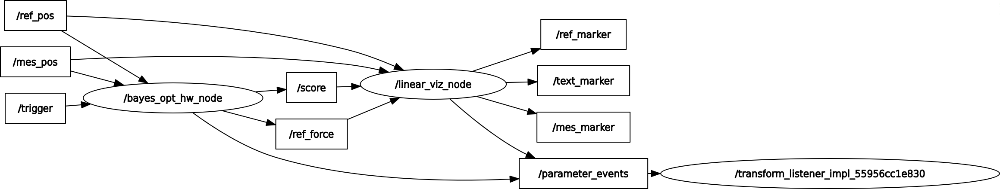
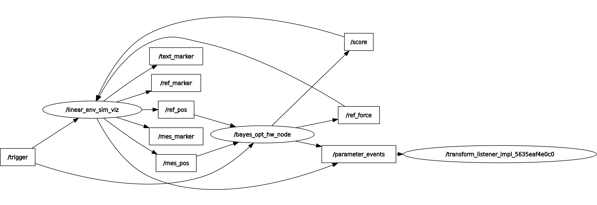
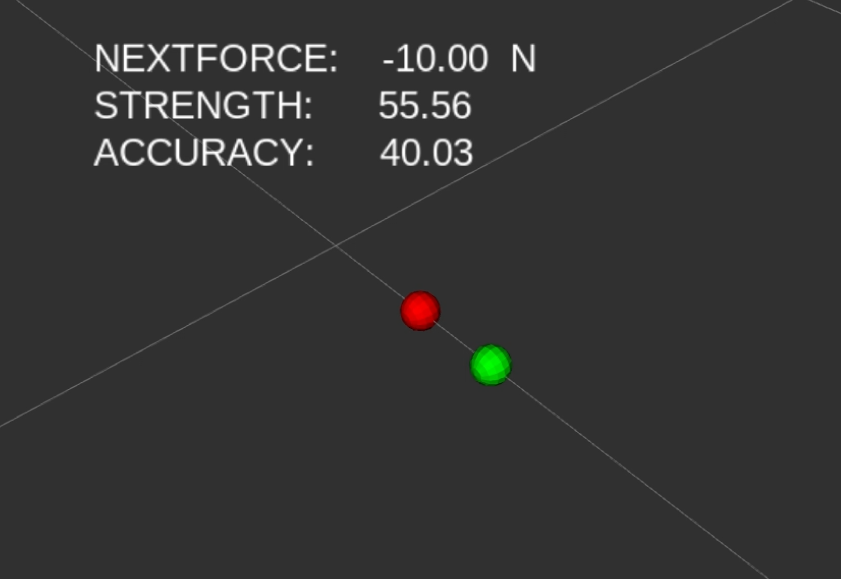
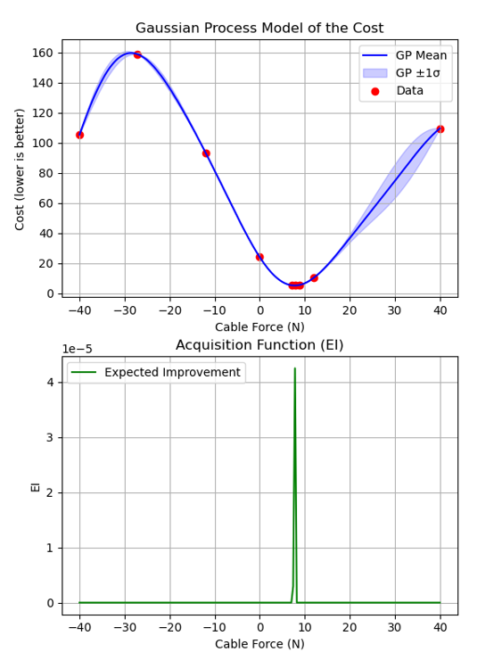

# Constant Force Optimization for RR ROS 2

This package demonstrates Bayesian optimization for a rehabilitation robot in ROS 2, designed for deployment in real systems. It aims to find the optimal constant rehabilitation assistive and resistive forces tailored for patients.

## Deployment Constraints
The high-level control logic is implemented in Python within a ROS 2 framework, while LabVIEW is used for hardware interfacing and the graphical user interface. This means that the system cannot be deployed as a standalone Python application. If you require LabVIEW integration, you can use the `cdrr_control` repository. Alternatively, if you prefer a different setup, you are free to create hardware settings tailored to your needs.

### Rosgraph for Deployment

- `/mes_pos`, `/ref_pos`, `/trigger` are sent by LabVIEW (or other sources). 
- `/ref_force` is the computed optimal constant force output.

### Rosgraph for Simulation

- `/mes_pos`, `/ref_pos` are computed in a virtual spring and damper environment.
- `/trigger` is still needed. You can use the following commands as an alternative:
```bash
ros2 topic pub -r 1 /trigger std_msgs/msg/Int32 "data: 0"
ros2 topic pub -r 1 /trigger std_msgs/msg/Int32 "data: 1"
```


## Usage


You can either deploy or simulate using:
```bash
ros2 launch rehab_robot_bayes_ros2 deployment_launch.py
ros2 launch rehab_robot_bayes_ros2 simulation_launch.py
```

After several repetiton of each cycle, Beyesian optimization is conducted.


